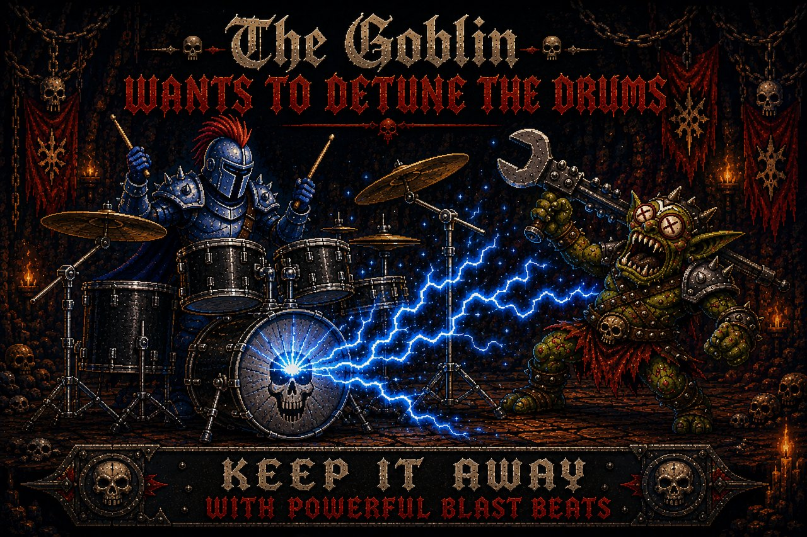

# Beatslayer



Interactive drum sheet music in your browser — built for music-school
practice rooms and tested on iPad. Sibling of
[Fretslayer](https://schneider128k.github.io/guitar/), the guitar trainer.

**Live site:** https://schneider128k.github.io/drum_scores/

## What it does

Search the catalog by artist or title, pick a song, and you get an
engraved drum score with a **live cursor** that follows the song's
official YouTube audio note-by-note. Practice tools built in:

- **Slow it down** — drop the tempo for hard fills, then bring it back up.
- **Loop a section** — repeat any range of bars, with a count-in, to drill
  a fill or groove until it's solid.
- **Lyrics under the staff** — sing or cue off the words while you play
  (where available).
- **Print** — a clean, paper-friendly layout for the music stand.

## Layout

```
/
├── index.html        searchable catalog (the front door)
├── songs.js          generated list of songs that feeds the search
├── vexflow/          the score reader + per-song score files
└── archive/          earlier renderers, kept for reference
```

The catalog is data-driven: `songs.js` is generated, so the search box,
the artist groupings, and the instrument filter all stay in sync as songs
are added. Drums today; the layout already makes room for other
instruments.

## Archive

The original grid and engraved-page views live under
[`archive/`](archive/index.html). They're frozen — no new songs — but kept
around so nothing is lost.

## Credits

Engraving by [VexFlow](https://www.vexflow.com/). Audio plays from each
song's official YouTube video, beat-synced to the score.
